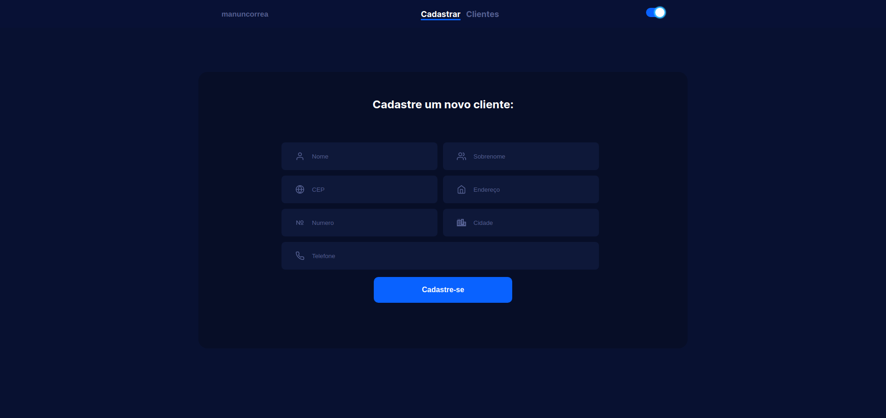
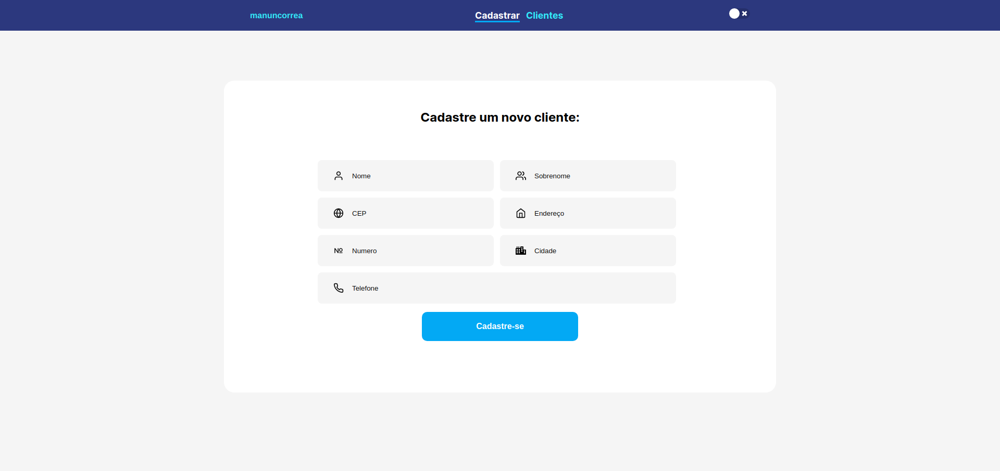

# Sistema de Cadastro


**Dark** 


**Light**



## :telescope: Tecnologias:
- React
- TypeScript
- Styled Components


```bash
# Clonar repositorios
$ git clone https://github.com/manuncorrea/sistema-de-cadastro

# Go into the repository
$ cd sistema-de-cadastro

# Instale dependências para o front-end e execute o servidor
$ yarn install
$ yarn start

```

**Resposta**

<!-- O meu nome é Emanuele tenho 27 anos e formei em Ciências da Computação no final de 2019, durante a faculdade eu cometi o erro de não fazer estagio, na área de desenvolvimento, por necessidade acabei fazendo estagio em suporte durante 3 anos. Devido a isso enfrentei dificuldades em arrumar o meu primeiro emprego na área por falta de experiência e até falta de conhecimentos técnicos. Ano passado devido à pandemia, achei que seria mais dificil conseguir o meu primeiro como dev, então decidi focar no que eu realmente queria, era ser uma dev front-end. Comecei estudar alguma stacks, principalmente o React, matriculei-me no bootcamp da Rocktseat, e alguns meses eu senti uma evolução que eu não senti nos anos de faculdade, hoje eu sinto-me muito mais preparada e capaz para o meu primeiro emprego como Dev junior.
 -->
