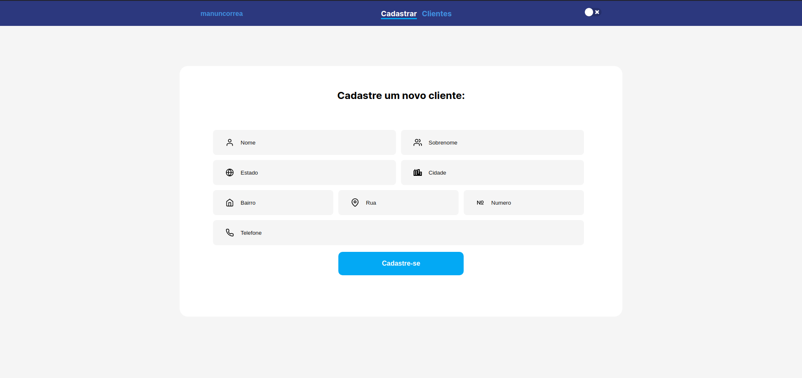

# Sistema de Cadastro


**Dark** 


**Light**



## :telescope: Tecnologias:
- React
- TypeScript
- Styled Components


```bash
# Clonar repositorios
$ git clone https://github.com/manuncorrea/sistema-de-cadastro

# Go into the repository
$ cd sistema-de-cadastro

# Instale dependências para o front-end e execute o servidor
$ yarn install
$ yarn start

```


 
